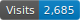
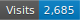
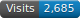
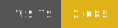
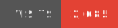
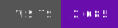

# Yet Another Github Visitor Counter

[](https://github.com/pa-ulander/ghvc/actions/workflows/tests.yml)[](https://github.com/pa-ulander/ghvc)[](https://github.com/pa-ulander/ghvc/actions/workflows/deploy.yml)

A Laravel-based GitHub profile visitor counter and github repository visitor counter that generates customizable SVG badges to display on your GitHub profile or in a repository's README.

Made only for fun and to try out new latest Laravel and testing utilities, like PEST & Dusk. 

## Usage

Add this to your profile page README.md to show a visitor counter badge:

```

```

It will generate a visitor counter badge that looks like this:


## Usage per repository

Add this to your repository README.md to show a visitor counter badge for a specific repository:

```

```


## Badge Customization Options

The visitor counter badge can be customized with the following URL parameters:

<table>
	<thead>
		<tr>
			<th width="140px">Parameter</th>
			<th width="340px">Description</th>
			<th width="90px">Default</th>
			<th>Example Values</th>
		</tr>
	</thead>
	<tbody>
		<tr>
			<td><code>username</code></td>
			<td>GitHub username (required)</td>
			<td>—</td>
			<td><code>?username=your-username</code></td>
		</tr>
		<tr>
			<td><code>label</code></td>
			<td>Text label displayed on the badge</td>
			<td>Visits</td>
			<td><code>label=Profile%20Views</code></td>
		</tr>
		<tr>
			<td><code>color</code></td>
			<td>Badge right-side (value) color</td>
			<td>blue</td>
			<td><code>color=green</code>, <code>color=ff5500</code>, <code>color=red</code></td>
		</tr>
		<tr>
			<td><code>labelColor</code></td>
			<td>Left-side label background (named or hex no #)</td>
			<td>blue</td>
			<td><code>labelColor=red</code>, <code>labelColor=ffd700</code></td>
		</tr>
		<tr>
			<td><code>style</code></td>
			<td>Badge style</td>
			<td>for-the-badge</td>
			<td><code>style=flat</code>, <code>style=flat-square</code>, <code>style=plastic</code></td>
		</tr>
		<tr>
			<td><code>base</code></td>
			<td>Starting count added to stored counter</td>
			<td>0</td>
			<td><code>base=100</code></td>
		</tr>
		<tr>
			<td><code>abbreviated</code></td>
			<td>Abbreviate large numbers (1.2K, 3.4M)</td>
			<td>false</td>
			<td><code>abbreviated=true</code></td>
		</tr>
		<tr>
			<td><code>repository</code></td>
			<td>Repository scope (per‑repo counter)</td>
			<td>(none)</td>
			<td><code>repository=my-repo</code></td>
		</tr>
		<tr>
			<td><code>logo</code></td>
			<td>Data URI image (png,jpg,gif,svg) OR simple-icons slug</td>
			<td>(none)</td>
			<td><code>logo=github</code>, <code>logo=laravel</code>, <code>logo=data:image/png;base64,iVBOR...</code></td>
		</tr>
		<tr>
			<td><code>logoSize</code></td>
			<td>Logo sizing: <code>auto</code> (SVG adapt) or fixed px (8–32)</td>
			<td>14</td>
			<td><code>logoSize=auto</code>, <code>logoSize=32</code></td>
		</tr>
		<tr>
			<td><code>logoColor</code></td>
			<td>Recolor SVG/simple-icon logo (named or hex, no #)</td>
			<td>f5f5f5</td>
			<td><code>logoColor=red</code>, <code>logoColor=ff8800</code>, <code>logoColor=brightgreen</code></td>
		</tr>
	</tbody>
</table>


## Examples

### Different Styles `style`

<table>
<thead><th width="140px">Style</th><th width="140px">Example</th><th>Markdown</th></thead>
<tr>
<td><code>for-the-badge</code></td>
<td></td>
<td><code></code></td>
</tr>

<tr>
<td><code>flat</code></td>
<td></td>
<td><code></code></td>
</tr>

<tr>
<td><code>flat-square</code></td>
<td></td>
<td><code></code></td>
</tr>

<tr>
<td><code>plastic</code></td>
<td></td>
<td><code></code></td>
		</tr>
		<tr>
			<td><code>red</code></td>
			<td></td>
			<td><code></code></td>
		</tr>
		<tr>
			<td><code>orange</code></td>
			<td></td>
			<td><code></code></td>
		</tr>
		<tr>
			<td><code>yellow</code></td>
			<td></td>
			<td><code></code></td>
		</tr>
	</tbody>
</table>

<table>
	<thead>
		<tr>
			<th width="140px">Hex Color</th>
			<th width="160px">Example</th>
			<th>Markdown</th>
		</tr>
	</thead>
	<tbody>
		<tr>
			<td><code>ffd700</code></td>
			<td></td>
			<td><code></code></td>
		</tr>
		<tr>
			<td><code>e34234</code></td>
			<td></td>
			<td><code></code></td>
		</tr>
		<tr>
			<td><code>6a0dad</code></td>
			<td></td>
			<td><code></code></td>
		</tr>
		<tr>
			<td><code>00b7eb</code></td>
			<td></td>
			<td><code></code></td>
		</tr>
	</tbody>
</table>


> [!NOTE]
> You must specify hex colors without the `#` prefix (e.g., `f000ff` instead of `#f000ff`).

### Custom Label Color `labelColor`:

<table>
	<thead>
		<tr>
			<th width="140px">Label Color</th>
			<th width="160px">Example</th>
			<th>Markdown</th>
		</tr>
	</thead>
	<tbody>
		<tr>
			<td><code>00aaff</code></td>
			<td></td>
			<td><code></code></td>
		</tr>
		<tr>
			<td><code>green</code></td>
			<td></td>
			<td><code></code></td>
		</tr>
		<tr>
			<td><code>yellow</code></td>
			<td></td>
			<td><code></code></td>
		</tr>
	</tbody>
</table>

### Color Combinations

<details>
<summary>All the named colors supported and the corresponding hex values:</summary>

| Color Name  | Swatch                                                                                                                      | Color Name    | Swatch                                                                                                                      |
| ----------- | --------------------------------------------------------------------------------------------------------------------------- | ------------- | --------------------------------------------------------------------------------------------------------------------------- |
| brightgreen | <span style="display:inline-block;width:20px;height:20px;background-color:#44cc11;border:1px solid #ccc;"></span> `#44cc11` | green         | <span style="display:inline-block;width:20px;height:20px;background-color:#97ca00;border:1px solid #ccc;"></span> `#97ca00` |
| yellowgreen | <span style="display:inline-block;width:20px;height:20px;background-color:#a4a61d;border:1px solid #ccc;"></span> `#a4a61d` | yellow        | <span style="display:inline-block;width:20px;height:20px;background-color:#dfb317;border:1px solid #ccc;"></span> `#dfb317` |
| orange      | <span style="display:inline-block;width:20px;height:20px;background-color:#fe7d37;border:1px solid #ccc;"></span> `#fe7d37` | red           | <span style="display:inline-block;width:20px;height:20px;background-color:#e05d44;border:1px solid #ccc;"></span> `#e05d44` |
| blue        | <span style="display:inline-block;width:20px;height:20px;background-color:#007ec6;border:1px solid #ccc;"></span> `#007ec6` | lightgray     | <span style="display:inline-block;width:20px;height:20px;background-color:#9f9f9f;border:1px solid #ccc;"></span> `#9f9f9f` |
| lightgrey   | <span style="display:inline-block;width:20px;height:20px;background-color:#9f9f9f;border:1px solid #ccc;"></span> `#9f9f9f` | gray          | <span style="display:inline-block;width:20px;height:20px;background-color:#555555;border:1px solid #ccc;"></span> `#555555` |
| grey        | <span style="display:inline-block;width:20px;height:20px;background-color:#555555;border:1px solid #ccc;"></span> `#555555` | blueviolet    | <span style="display:inline-block;width:20px;height:20px;background-color:#8a2be2;border:1px solid #ccc;"></span> `#8a2be2` |
| success     | <span style="display:inline-block;width:20px;height:20px;background-color:#97ca00;border:1px solid #ccc;"></span> `#97ca00` | important     | <span style="display:inline-block;width:20px;height:20px;background-color:#fe7d37;border:1px solid #ccc;"></span> `#fe7d37` |
| critical    | <span style="display:inline-block;width:20px;height:20px;background-color:#e05d44;border:1px solid #ccc;"></span> `#e05d44` | informational | <span style="display:inline-block;width:20px;height:20px;background-color:#007ec6;border:1px solid #ccc;"></span> `#007ec6` |
| inactive    | <span style="display:inline-block;width:20px;height:20px;background-color:#9f9f9f;border:1px solid #ccc;"></span> `#9f9f9f` | —             | —                                                                                                                           |
>[!NOTE]
**Any hex color can be used instead**   :art:
</details>

### Custom Label `label`

<table>
	<thead>
		<tr>
			<th width="160px">Custom Label</th>
			<th width="200px">Example</th>
			<th>Markdown</th>
		</tr>
	</thead>
	<tbody>
		<tr>
			<td><code>Profile%20Visitors</code></td>
			<td></td>
			<td><code></code></td>
		</tr>
		<tr>
			<td><code>Chocolate%20Cookies</code></td>
			<td></td>
			<td><code></code></td>
		</tr>
		<tr>
			<td><code>Horsepowers</code></td>
			<td></td>
			<td><code></code></td>
		</tr>
	</tbody>
</table>

### Number Abbreviation

Display large numbers in abbreviated format (1K, 1.5M, etc.):

```

```


## Logo or icon usage

Supported image types: <code>png | svg</code>

The `logo` parameter supports the following input;

### Simple Icons
Any simple‑icons slug. Like `logo=github`, `logo=laravel` ...etc.  
<table>
	<thead>
		<tr>
			<th width="80px">Slug</th>
			<th width="160px">Example</th>
			<th>Markdown</th>
		</tr>
	</thead>
	<tbody>
		<tr>
			<td><code>github</code></td>
			<td></td>
			<td><code></code></td>
		</tr>
        <tr>
			<td><code>laravel</code></td>
			<td></td>
			<td><code></code></td>
		</tr>
	</tbody>
</table>

#### Simple Icons or svg's with color `logoColor`

When using a simpleicon slug, or logo/icon with a fillable format, ie `svg`, you can also set the logoColor.   

> [!NOTE]
> `logoColor` only affects the fill color on simple icon slugs or `svg` logos.  
> If you try to use it on a `png` logo it will have no effect.

<table>
	<thead>
		<tr>
			<th width="120px">Slug</th>
			<th width="160px">Example</th>
			<th>Markdown</th>
		</tr>
	</thead>
	<tbody>
		<tr>
			<td><code>refinedgithub</code></td>
			<td></td>
			<td><code></code></td>
		</tr>
        <tr>
			<td><code>laravel</code></td>
			<td></td>
			<td><code></code></td>
		</tr>
	</tbody>
</table>


### Logo from a data URI (raw or URL‑encoded): 
You can use your own custom logo by embedding it as a data URI.  
* Full data URI - Example: `logo=data:image/png;base64,iVBOR...`  
* Raw base64 blob without the `data:` prefix - Example: `logo=iVBORw0KGgoAAAANSUhEUgAA...`  
* Urlencoded base64 blob with `data:` prefix - Example: `logo=data%3Aimage%2Fsvg%2Bxml%3Bbase64%2CPD94bWwgdmVyc...`  
 
Both works, but the first is preferred as it needs less processing and therefore gets rendered a little bit quicker.

### Logo from a base64 encoded and urlencoded SVG using full data URI
This is the "proper" and recommended way to add a logo or icon to your badge. 

```m̀arkdown 
![](https://ghvc.kabelkultur.se?username=your-username&label=Visits&style=for-the-badge&logoColor=ffff00&logo=data%3Aimage%2Fsvg%2Bxml%3Bbase64%2CPD94bWwgdmVyc2lvbj0iMS4wIiBlbmNvZGluZz0idXRmLTgiPz48IS0tIFVwbG9hZGVkIHRvOiBTVkcgUmVwbywgd3d3LnN2Z3JlcG8uY29tLCBHZW5lcmF0b3I6IFNWRyBSZXBvIE1peGVyIFRvb2xzIC0tPg0KPHN2ZyB3aWR0aD0iODAwcHgiIGhlaWdodD0iODAwcHgiIHZpZXdCb3g9IjAgMCAyNCAyNCIgZmlsbD0ibm9uZSIgeG1sbnM9Imh0dHA6Ly93d3cudzMub3JnLzIwMDAvc3ZnIj4NCjxwYXRoIGZpbGwtcnVsZT0iZXZlbm9kZCIgY2xpcC1ydWxlPSJldmVub2RkIiBkPSJNMjAuOTk5MiA1Ljk1ODQ2QzIxLjAwODcgNi41NjUgMjAuOTMzMyA3LjMyNjQ5IDIwLjg2NTggNy44ODA3QzIwLjgzOTUgOC4wOTY4NiAyMC44MDM3IDguMjc2NzYgMjAuNzY1MyA4LjQyNDUzQzIxLjYyMjcgMTAuMDEgMjIgMTEuOTE3NCAyMiAxNEMyMiAxNi40Njg0IDIwLjgxMjcgMTguNTAxIDE4Ljk2MzggMTkuODg3MUMxNy4xMzE5IDIxLjI2MDUgMTQuNjYwNiAyMiAxMiAyMkM5LjMzOTM5IDIyIDYuODY4MDkgMjEuMjYwNSA1LjAzNjIgMTkuODg3MUMzLjE4NzI3IDE4LjUwMSAyIDE2LjQ2ODQgMiAxNEMyIDExLjkxNzQgMi4zNzczMiAxMC4wMSAzLjIzNDcyIDguNDI0NTJDMy4xOTYzMSA4LjI3Njc2IDMuMTYwNTUgOC4wOTY4NSAzLjEzNDIyIDcuODgwN0MzLjA2NjczIDcuMzI2NDkgMi45OTEzMyA2LjU2NSAzLjAwMDgxIDUuOTU4NDZDMy4wMTE0OSA1LjI3NTA2IDMuMTAwODIgNC41OTE3IDMuMTk5ODggMy45MTM3OUMzLjI0NTY5IDMuNjAwMjggMy4zMTg0MyAzLjMwNTQ3IDMuNjU4ODMgMy4xMTkxN0M0LjAwNjU1IDIuOTI4ODYgNC4zNzI3NCAyLjk5OTgxIDQuNzMzOTggMy4xMDIxQzUuOTUyNDcgMy40NDcxMyA3LjA5NDg3IDMuOTMxMDggOC4xNjgwMyA0LjUxMjg3QzkuMjk5NSA0LjE3Mjg3IDEwLjU3ODMgNCAxMiA0QzEzLjQyMTcgNCAxNC43MDA1IDQuMTcyODcgMTUuODMyIDQuNTEyODdDMTYuOTA1MSAzLjkzMTA4IDE4LjA0NzUgMy40NDcxMyAxOS4yNjYgMy4xMDIxQzE5LjYyNzMgMi45OTk4MSAxOS45OTM1IDIuOTI4ODYgMjAuMzQxMiAzLjExOTE3QzIwLjY4MTYgMy4zMDU0NyAyMC43NTQzIDMuNjAwMjggMjAuODAwMSAzLjkxMzc5QzIwLjg5OTIgNC41OTE3IDIwLjk4ODUgNS4yNzUwNiAyMC45OTkyIDUuOTU4NDZaTTIwIDE0QzIwIDEyLjMxMjggMTkuNjEyMiAxMCAxNy41IDEwQzE2LjU0NzggMTAgMTUuNjQ3NCAxMC4yNTAyIDE0Ljc0NzQgMTAuNTAwNEMxMy44NDgyIDEwLjc1MDIgMTIuOTQ5NSAxMSAxMiAxMUMxMS4wNTA1IDExIDEwLjE1MTggMTAuNzUwMiA5LjI1MjYzIDEwLjUwMDRDOC4zNTI2MSAxMC4yNTAyIDcuNDUyMTYgMTAgNi41IDEwQzQuMzkzNzkgMTAgNCAxMi4zMTk3IDQgMTRDNCAxNS43NjM2IDQuODI3NDUgMTcuMjMxIDYuMjM1ODggMTguMjg2OUM3LjY2MTM1IDE5LjM1NTYgOS42OTAwNSAyMCAxMiAyMEMxNC4zMDk5IDIwIDE2LjMzODYgMTkuMzU1NSAxNy43NjQxIDE4LjI4NjlDMTkuMTcyNiAxNy4yMzEgMjAgMTUuNzYzNiAyMCAxNFpNMTAgMTQuNUMxMCAxNS44ODA3IDkuMzI4NDMgMTcgOC41IDE3QzcuNjcxNTcgMTcgNyAxNS44ODA3IDcgMTQuNUM3IDEzLjExOTMgNy42NzE1NyAxMiA4LjUgMTJDOS4zMjg0MyAxMiAxMCAxMy4xMTkzIDEwIDE0LjVaTTE1LjUgMTdDMTYuMzI4NCAxNyAxNyAxNS44ODA3IDE3IDE0LjVDMTcgMTMuMTE5MyAxNi4zMjg0IDEyIDE1LjUgMTJDMTQuNjcxNiAxMiAxNCAxMy4xMTkzIDE0IDE0LjVDMTQgMTUuODgwNyAxNC42NzE2IDE3IDE1LjUgMTdaIiBmaWxsPSIjMDAwMDAwIi8%2BDQo8L3N2Zz4%3D)
```


### Logo from a raw base64 encoded PNG using full data URI

```markdown
![](https://ghvc.kabelkultur.se/?username=your-username&label=Visits&style=for-the-badge&color=orange&labelColor=green&logo=data:image/png;base64,iVBORw0KGgoAAAANSUhEUgAAACAAAAAgCAYAAABzenr0AAAABHNCSVQICAgIfAhkiAAAAAlwSFlzAAAA7AAAAOwBeShxvQAAABl0RVh0U29mdHdhcmUAd3d3Lmlua3NjYXBlLm9yZ5vuPBoAAAKQSURBVFiFtdffi1VVFAfwzz3MOA4yDWr5A6VMHX0oIhlhBkPxReYlgp6MKFHM8Af4qqSI/gGJT9pTPkpvPUmo5NNERk1UoGFagSKi5kihAyP3Tg/7HOfM8ez7y3u/sOCw14/vOuvsvdY+Fa2hB8N4C6uwMF2fxN/4BT+h2mLchhjFWTzCTAOZxJcY6QTxm7jUBGlMLuKNdogrOIzpFyDPZBr7WyGfh686QFyUM+htRN6Dr7tAnsk5obpRnOoieSZHYuTvolYwPoTF+BgTLZBM4KPU93BBV8W2jDQrRz+u4bVCUqO4kj4n2CX0gB/xFx6mukV4HRvxq3Bka6luE8YLcX/DBrl+cTDyJmsj1WoF6yKxd2YGFdyIGG3uQAJbIrGvo5IIJVpT4lg1W8YXQVV5ax7CSIKxiONpz3+7djCOLyK6MbigvERlVWkXQxGObwhTrKi43UHyDHdKeP5M8HKJ8f0uJHCvZO2VROj9RQx0IYGXStb6ErPNJI8lGvTsFpGkMYt4mOBBiWIAb3cwgWEsKFm/l+BqxOmDDiawPbJ+FQ4oPyJPdOYoDmEqwrGP0KuLUzCTP4TLZ7tYjZuR2DW5WfNtTjGO73NJ/SvM8KUtEC/HMfwXIZ8R7ovP8H5OcR6vYoe5d8Iqfsbnyk9IBSeFcRyraF7eKzpfzim/wyBOlDjurfPmnzZBPCPctJ/DenM3yx5hA53AXTzGD+p/ipVNkE8J+64UH5ot3y0sSwmH8I7G94PeBuQ1TRzvz3IOvwv7Y1D4TCvU75A9DRI41Ig8w27xn5KeOn6xCjyVnvlWsFXoA8VgZcMrQ1+J/fU0Vlvox3H8kwvY12QCD4ReML9d8mIin6jzU5HD0dS2v5nA/wOcRnFtFu2FpwAAAABJRU5ErkJggg==)
```


<br>

> [!NOTE]
> The above examples will work also if the data uri part: ` data:image/png;base64, ` is omitted and only the raw encoded string is used. 
> But that is not recommended as it takes longer to process, and the logo can also be refused by validation or just ignored.  
> The recommended way is to use the full data uri and also urlencode the logo string.


## Logo size options

Use the logoSize parameter to control how large the logo appears on your badge:

`logoSize=auto` – keeps the logo’s original proportions while fitting it to the badge.
`logoSize=12` – sets the logo to a specific size (any number from 8 up to 32). Handy when a logo feels too large or too small.  

Examples:

```markdown
...&logo=github&logoSize=auto
...&logo=github&logoSize=12
```

Try different values, refresh the badge, and pick the look you like best.

### Example with fixed size (28px):
```

```


## Limitations

Some limtiations are applied:

* Maximum decoded logo size: 10 KB. Larger images are silently ignored.
* Maximum raster (PNG width/height: 32×32 pixels. Larger raster images are silently ignored (not resized).
* Supported formats: `png` and `svg`. Anything else is ignored without error.
* Rejected / ignored logos never break the badge – it simply renders without the `logo`.
* Basic rate limiting protects the service. If you see HTTP 429, reduce request frequency.


## Full Customization Example

```

```


## Self-hosting
This is a Laravel-based application that can be self-hosted.  
See the project structure and Docker configuration for details on how to set up your own instance.  
Documentation for development and self-hosting is in the making and will be added at some point.  
If you know basic Laravel and Docker it should be fairly straightforward to get it up and running.  
Clone away and have badges of fun!  

## Acknowledgments

[Badges](https://github.com/badges) for the cool [Poser](https://github.com/badges/poser) library. A php library that creates badges.

[Awesome Badges](https://github.com/badges/awesome-badges) a curated list of awesome badge things.

[Simple Icons](https://github.com/simple-icons/simple-icons) SVG icons for popular brands.

## License

[MIT](LICENSE)